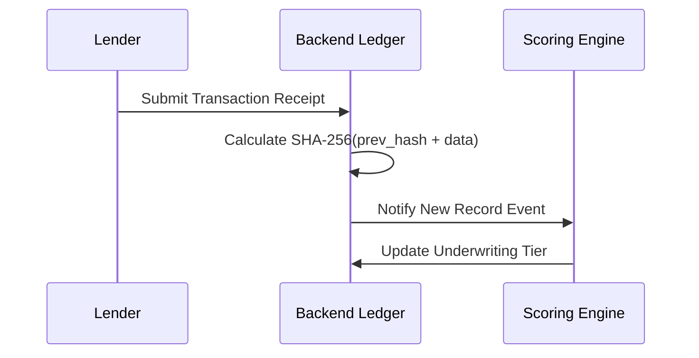

```mermaid
sequenceDiagram
  participant L as Lender
  participant B as Backend Ledger
  participant S as Scoring Engine
  L->>B: Submit Transaction Receipt
  B->>B: Calculate SHA-256(prev_hash + data)
  B->>S: Notify New Record Event
  S->>B: Update Underwriting Tier
```
